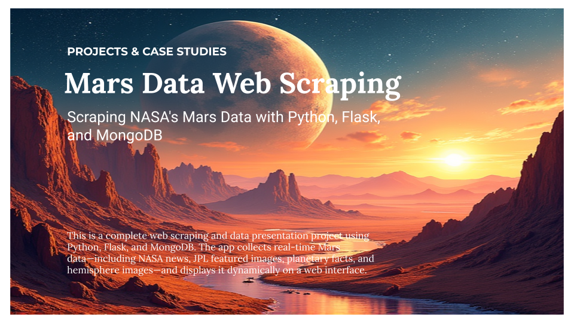

  

# Mars Web Scraping Project

This project demonstrates the use of **web scraping** techniques to collect and organize Mars-related data from multiple public sources. Using Python tools such as `BeautifulSoup`, `Splinter`, and `Pandas`, the data is scraped, cleaned, and stored in a **MongoDB** database. The final dataset serves as the foundation for a web-based dashboard built with **Flask**. This project is part of a structured approach to developing, documenting, and sharing high-quality data analytics work. Each project is designed with two core goals in mind: **to educate** and **to inspire**. The process is broken into logical phases to ensure clarity, scalability, and consistent quality.

### Objectives
- Apply real-world data skills such as scraping, transformation, visualization, and deployment.
- Produce content that explains the *how* and *why* behind the work for others in the community.

## Project Objectives
- Scrape data from multiple sources (news, images, facts, hemispheres)
- Store results in a NoSQL database (MongoDB)
- Build a structured pipeline with modular Python scripts
- Visualize data via a Flask-powered dashboard

## Characteristics of a Good Scraping Target
- Publicly accessible (no login/auth required)
- Static and stable HTML structure
- Minimal JavaScript rendering
- Content-rich (articles, tables, images)

## Alternative Beginner-Friendly Scraping Sites
| Site                | Use Case                                  |
|---------------------|--------------------------------------------|
| Books to Scrape     | E-commerce-style listings and prices       |
| Quotes to Scrape    | Pagination, quotes, and author info        |
| IMDB (Top 250)      | Movie titles, ranks, ratings               |
| Real Python Blog    | Blog scraping: titles, summaries, dates    |
| Hacker News         | Headlines and vote counts                  |

## Recommended Notebook Workflow
1. **Imports**: Load core libraries (requests, BeautifulSoup, etc.)
2. **Scraping Functions**: Define and test one function per target
3. **Debug and Inspect**: Check raw HTML, element tags, class names
4. **Process Data**: Use Pandas for tables and data cleanup
5. **Optional Visualizations**: Add plots using matplotlib/seaborn
6. **Web Integration**: Build a Flask app to serve scraped content

This structure ensures modular development, reusability, and a clear path from raw data to live presentation.

## Data Sources
- NASA Mars News
- JPL Featured Space Image
- Mars Facts Table
- Mars Hemispheres (USGS)

## Phase 1: Web Scraping & Data Preparation (Notebook Development)
This phase focuses on building and debugging the scraping logic using a Jupyter Notebook. Each target source is handled individually to ensure accurate data extraction and transformation.

## Step 1: Scraping the Latest NASA Mars News
To begin this project, I used web scraping techniques to collect the most recent Mars-related news from [NASA’s Mars News site](https://redplanetscience.com). The goal of this step was to extract both the **headline** and a **teaser paragraph** from the top article on the homepage.

### Tools Used
- Python
- BeautifulSoup for parsing HTML
- Selenium for browser automation
- ChromeDriver to simulate browser interactions

### Key Steps
1. Launched a browser session using Selenium.
2. Navigated to the NASA Mars News site.
3. Waited for the content to fully load.
4. Parsed the HTML with BeautifulSoup.
5. Located the first news title and paragraph using class selectors.

### Outcome
The scraper successfully returns:
- The **latest news title** (e.g., *NASA's Perseverance Rover Begins the Hunt for Ancient Life*).
- A short **teaser summary** of the article.

This scraped content becomes the first component of the unified Mars data dictionary later inserted into MongoDB and rendered in the final Flask web app.

---

## Step 2: JPL Featured Mars Image
In this step, I scraped the **current featured Mars image** from the [Jet Propulsion Laboratory (JPL) Space Images site](https://spaceimages-mars.com/). The objective was to retrieve the full-resolution URL of the featured image that is visually highlighted on the homepage.

### Tools Used
- Python
- BeautifulSoup
- Splinter (browser automation layer built on top of Selenium)

### Key Steps
1. Launched a browser session using Splinter.
2. Visited the JPL Mars Space Images site.
3. Parsed the HTML content using BeautifulSoup.
4. Located the featured image thumbnail within a specific `img` tag.
5. Extracted the `src` attribute and constructed the absolute URL.

### Outcome
The scraper returns the **full URL** of the currently featured Mars image. This image is later used as a key visual asset in the final web dashboard.

---

## Step 3: Mars Facts Table
This step involved scraping a comparative facts table about Mars and Earth from the [Galaxy Facts website](https://galaxyfacts-mars.com/). The goal was to transform tabular data into an HTML format for embedding later in the Flask app.

### Tools Used
- Python
- Pandas
- BeautifulSoup (implicitly, via `read_html`)

### Key Steps
1. Utilized Pandas’ `read_html()` method to scrape all HTML tables from the site.
2. Selected the first table, which compares Mars and Earth data.
3. Renamed columns and set the description column as the index.
4. Converted the cleaned DataFrame into an HTML table string using `.to_html()`.

### Outcome
The final output is a clean, responsive HTML string of the Mars–Earth comparison table, ready to be stored in MongoDB and rendered dynamically via Flask.

---

## Step 4: Mars Hemispheres
This step focused on scraping **high-resolution images and titles** for each of Mars' four hemispheres from the [USGS Astrogeology site](https://marshemispheres.com/).

### Tools Used
- Python
- BeautifulSoup
- Splinter

### Key Steps
1. Visited the main page and extracted links to each hemisphere’s detail page.
2. Iterated through the pages using Splinter.
3. On each page, parsed the HTML with BeautifulSoup.
4. Retrieved the title and full-resolution image URL from the downloads section.
5. Stored each hemisphere’s data in a dictionary and appended to a list.

### Troubleshooting
During development, I encountered a persistent issue where the hemisphere image list was returning as empty. Initially, I incorrectly assumed the endpoint was returning standard HTML content. However, upon further inspection, I realized the data was actually served through a **JSON endpoint**. Once I adjusted my parsing logic to correctly retrieve the data from this structure—and updated the placeholder reference in the `.html` template—the issue was resolved and the images rendered successfully.

### Outcome
The final output is a list of dictionaries containing:
- `title`: Name of the hemisphere
- `img_url`: Link to the high-resolution image

This data is later stored in MongoDB and integrated into the dashboard interface.

## Phase 2: Production Pipeline (Script + MongoDB + Flask)
This phase moves the code into production-ready Python scripts. It includes database integration and building a web application to present the data.

### Step 1: Create `scrape_mars.py`

**Tools Used:**
- Python
- Jupyter Notebook (initial logic)
- Standard libraries (time, datetime)
- Custom functions for scraping

**Key Steps:**
- Transferred finalized scraping logic into a Python script.
- Defined a `scrape_all()` function that calls each scrape module.
- Returned results in a unified dictionary.

**Outcome:**
- Created a reusable script to be triggered by the Flask app.
- Modular design allows for independent updates to scraping logic.

---

### Step 2: Integrate MongoDB for Storage

**Tools Used:**
- MongoDB (local instance via Compass)
- `pymongo` for Python-MongoDB interface

**Key Steps:**
- Connected to a local MongoDB database (`mars_db`).
- Inserted scraped data into a `mars` collection.
- Used `.update_one()` with `upsert=True` to replace old data.

**Outcome:**
- Enabled persistent storage of scraped Mars data.
- Prepared backend for integration with Flask app.

- - -

### Step 3: Deploy Flask App to Load Data from MongoDB

**Tools Used:**
- Flask (Python web framework)  
- Jinja2 (Flask templating engine)  
- PyMongo (MongoDB-Flask bridge)

**Key Steps:**
- Established a Flask route (`/`) that queries the `mars` collection from the local MongoDB.
- Passed the retrieved data as a dictionary to the `index.html` template using `render_template()`.
- Built a dynamic HTML layout using Jinja2 templating syntax to display Mars data (news, facts, images, hemispheres).
- Ensured the app gracefully handled cases where the database might be empty or missing fields.

**Troubleshooting:**
- Resolved a key issue with image output by correcting the `.html` file reference to the hemisphere placeholders in the template. This was essential for displaying images dynamically from the MongoDB content.

**Outcome:**
- Successfully rendered a dynamic web page powered by Flask and MongoDB.
- Validated integration between scraping logic, data persistence, and frontend display.
- Ready for styling improvements and optional deployment via Heroku.

## Phase 3: Finalization, Documentation, and Enhancements

With the core functionality complete, Phase 3 focuses on refining the project for presentation and public sharing. This includes writing the final `README.md` documentation, drafting a detailed Medium article to summarize the project journey, and brainstorming optional enhancements to elevate the project from beginner to intermediate level. Potential improvements include visual upgrades using CSS, integrating data visualizations or charts, and deploying the app using Heroku for accessibility and future updates.

## Step 3 - Submission

To submit your work to BootCampSpot, create a new GitHub repository and upload the following:
1. The Jupyter Notebook containing the scraping code used.
2. Screenshots of your final application.
3. Submit the link to your new repository to BootCampSpot.
4. Ensure your repository has regular commits (i.e. 20+ commits) and a thorough README.md file

=======
